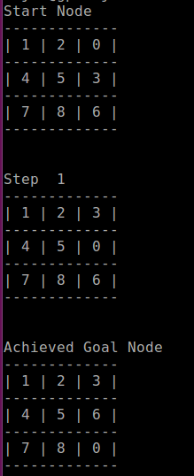

# 8puzzle
## Overview
Solving the 8 puzzle problem using bfs. The file 8puzzle takes initial configuration in column form
as input and write all the steps to reach the goal state in the text file. If the initial state is the same
as the goal state then no text file is generated. Since all initial configurations do not result in the 
possible goal state, for such not feasible initial states, a blank text file is generated. 

## Dependencies
Following system and library dependencies must be met to run the code succesfully:
```
1. python3.5
2. numpy (library)
3. queue (library)
4. sys (library)
5. ubuntu16.04
```

## Running the code
In order to run the code run the following command from your terminal:
```
1. First go to the directory where the code is present
2. python3 8puzzle.py <initial_state>
3. For example python3 8puzzle.py 143205678
```

## Sample result
